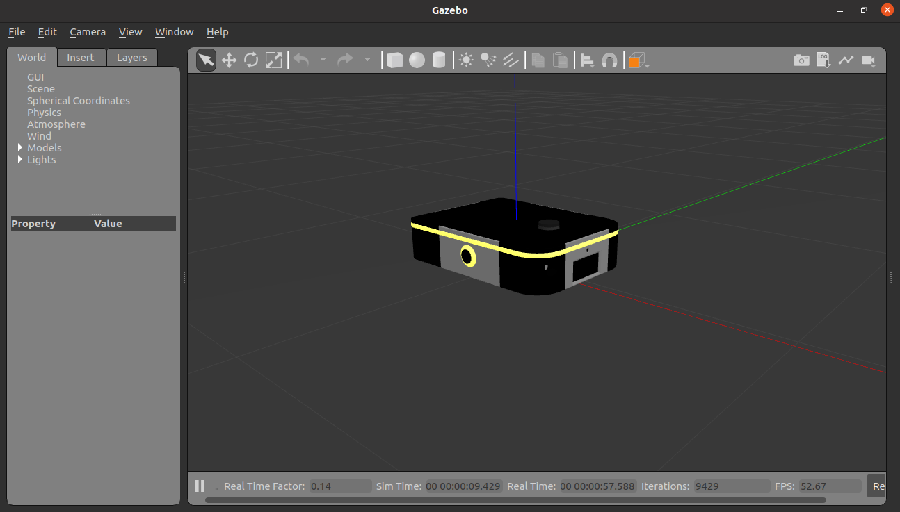
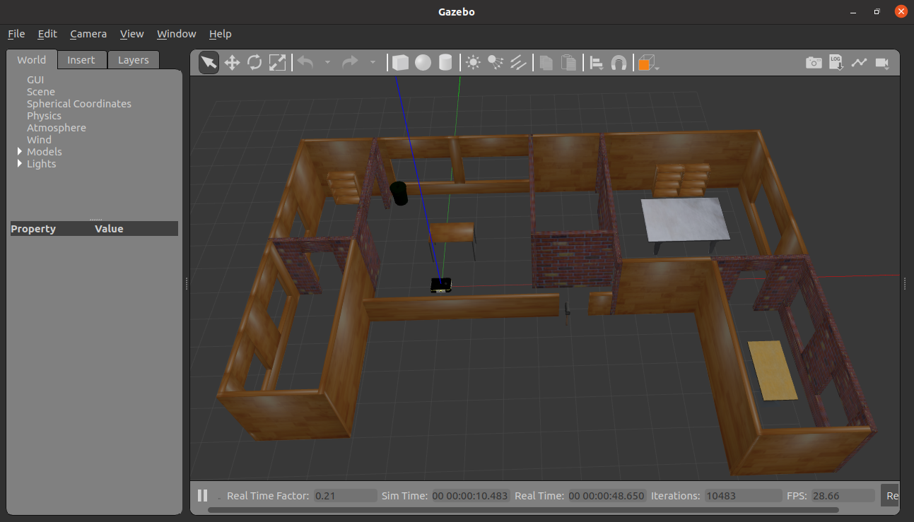
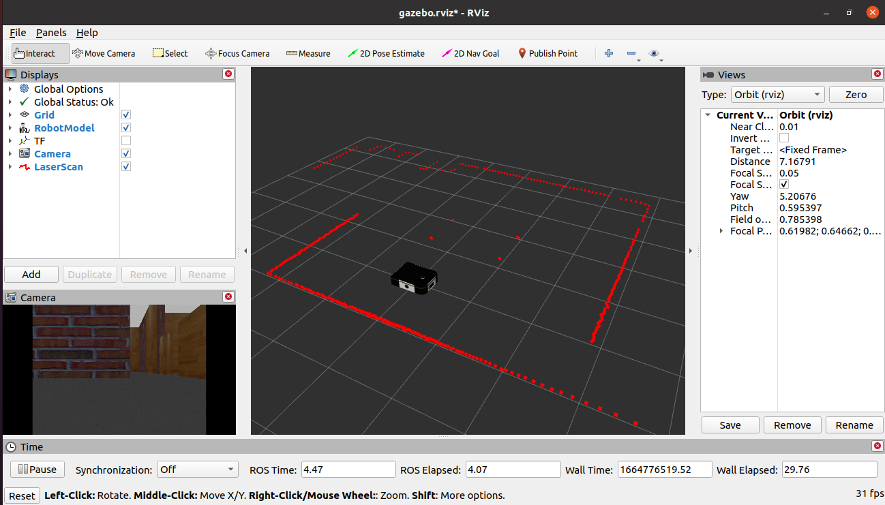
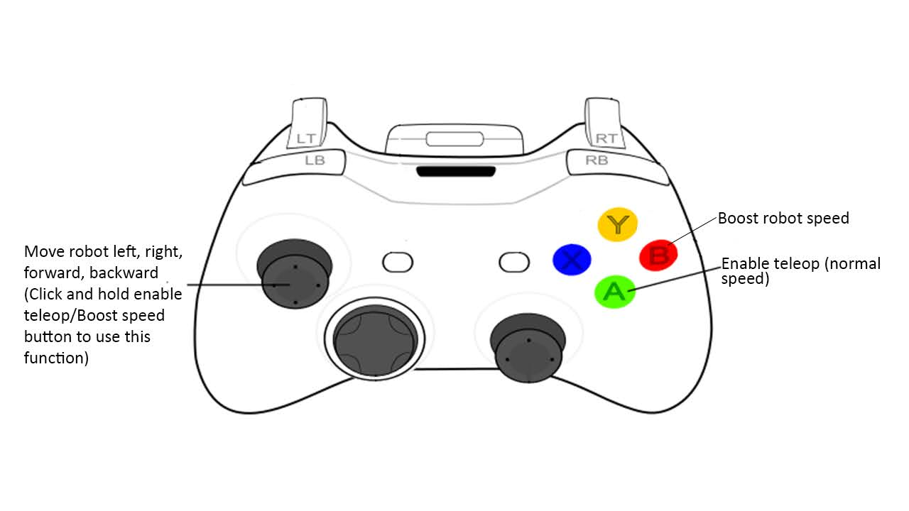
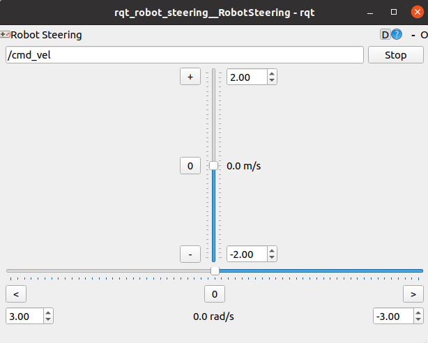
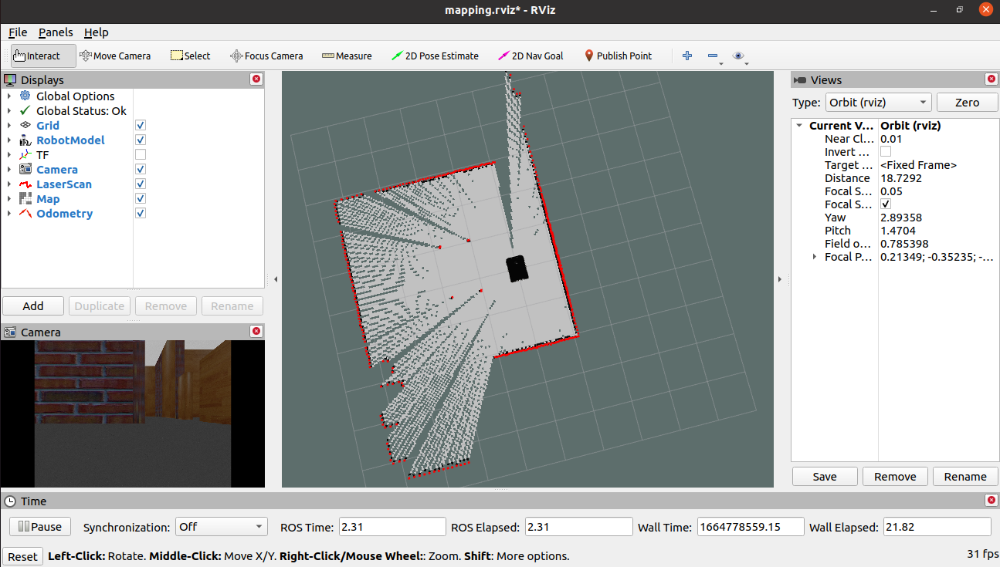
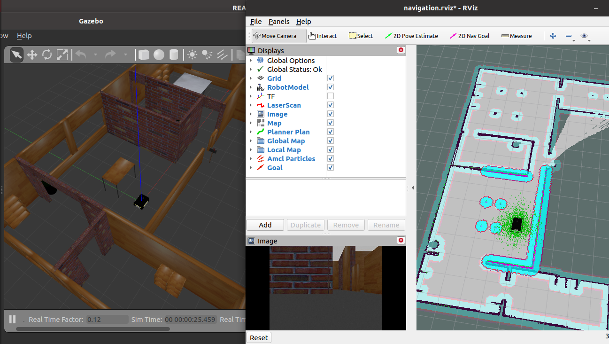
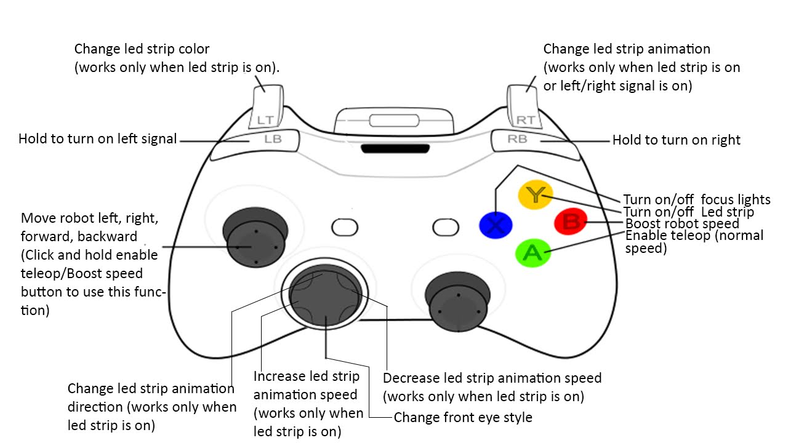

<!-- PROJECT SHIELDS -->

[![ROS][ros-shield]][ros-url] 
<!-- [![Contributors][contributors-shield]][contributors-url] [![Last Commit][last-commit-shield]][last-commit-url] [![Stargazers][stars-shield]][stars-url] [![Issues][issues-shield]][issues-url] [![MIT License][license-shield]][license-url] -->

<!-- PROJECT LOGO -->

<div align="center">
<h3 align="center">NINJABOT</h3>
<h6 align="center">Autonomous Mobile Robot</h6>
 <a href="https://github.com/chaitanya-mandala/ninjabot">
    
    
    
  </a>
</div>

</br>
<!-- TABLE OF CONTENTS -->
<details>
  <summary>Table of Contents</summary>
  <ol>
    <li>
      <a href="#simulation">Simulation</a>
      <ul>
        <li><a href="#setup">Setup</a></li>
        <li><a href="#gazebo">Gazebo</a></li>
        <li><a href="#rviz">Rviz</a></li>
        <li><a href="#teleop">Teleop</a></li>
        <li><a href="#slam">SLAM</a></li>
        <li><a href="#navigation">Navigation</a></li>
      </ul>
    </li>
    <li>
      <a href="#real-robot">Real Robot</a>
      <ul>
        <li><a href="#prerequisites">Prerequisites</a></li>
        <li><a href="#connecting_pc_to_robot">Connecting PC to robot</a></li>
        <li><a href="#connect_robot_to_wifi">Connect robot to WiFi</a></li>
        <li><a href="#network_configuration">Network configuration</a></li>
        <li><a href="#ninjabot_service">Ninjabot service</a></li>
        <li><a href="#joystic_control">Joystic control</a></li>
        <li><a href="#mapping">Mapping</a></li>
        <li><a href="#ninjabot_navigation">Navigation</a></li>
      </ul>
    </li>
    <li><a href="#roadmap">Roadmap</a></li>
    <li><a href="#contributing">Contributing</a></li>
    <li><a href="#license">License</a></li>
    <li><a href="#references">References</a></li>
  </ol>
</details>

<!-- Simulation -->

## Simulation

Ninjabot Gazebo simulation.

#### Setup

1. Clone the repo to ~/catkin_ws/src
   ```sh
   roscd && cd .. && cd src
   git clone https://gitlab.com/UnrealRobotics/ninjabot.git
   ```
2. Install ros dependency packages, Execute in ~/catkin_Ws
   ```sh
   cd ..
   rosdep install --from-paths src --ignore-src -r -y
   ```
3. Compile catkin workspace
   ```sh
   catkin_make
   ```

#### Gazebo

1. Ninjabot in empty world.

   ```sh
   roslaunch ninjabot_simulation gazebo.launch world:=empty
   ```

      
   <br></br>

2. Ninjabot in house.
   ```sh
   roslaunch ninjabot_simulation gazebo.launch world:=house
   ```
   

#### Rviz

1. Launch Gazebo simulation.

2. Launching Rviz.
   ```sh
   roslaunch ninjabot_simulation rviz.launch
   ```
   

#### Teleop

1. Keyboard Twist teleop.

```sh
rosrun teleop_twist_keyboard teleop_twist_keyboard.py
```

keyboard commands to Move robo

```sh
Reading from the keyboard  and Publishing to Twist!
---------------------------
Moving around:
   u    i    o
   j    k    l
   m    ,    .

q/z : increase/decrease max speeds by 10%
w/x : increase/decrease only linear speed by 10%
e/c : increase/decrease only angular speed by 10%
anything else : stop

CTRL-C to quit
```

2. JoyStick Twist teleop.

```sh
roslaunch ninjabot_teleop joy_teleop.launch
```

3. Rqt robot steering

```sh
rosrun rqt_robot_steering rqt_robot_steering
```


<!-- ROADMAP -->

### SLAM

1. Launch Gazebo simulation.
2. Launching SLAM mapping node.

```sh
roslaunch ninjabot_mapping ninjabot_gmapping.launch
```

3. Open rviz

```sh
roslaunch ninjabot_mapping gmappin_rviz.launch
```

move robo with twist teleop for mapping entire area.


4. Save map.

```sh
roslaunch ninjabot_mapping save_map.launch map_name:=<NEW_MAP_NAME>
```

New map will be saved in _catkin_ws/src/ninjabot/ninjabot_mapping/maps/_ folder with given map name. _<b>(Please give map name same as world name for easy convinence for launching navigation.)</b>_

eg:

```sh
roslaunch ninjabot_mapping save_map.launch map_name:=house
```

### Navigation

1. Close all gazebo and rviz windows.

2. Launch Navigation

```sh
roslaunch ninjabot_navigation ninjabot_navigation.launch map:=house localPlanner:=teb
```
(~map, name of map avilable in ninjabot_mapping/maps, same for both gazebo world and map name)
(~localPlanner:=teb or dwa, for Timed Elastic Band localplanner or Dynamic Window Approach planner. default is "dwa")


## Real-Robot

### Prerequisites

1. NinjaBot Physical robot
2. WiFi router
3. RJ45 Lan Cable
4. PC wih ROS installed
5. Joystick (optional)

### Connecting_pc_to_robot

1. Connect through LAN - connect robot and workstation(PC) through RJ45 lan cable and turn on robot wait untill green led on raspberrypi is on steady. - Now open terminal in pc and connect to robot via ssh
   `sh ssh ubuntu@ninjabot.local ` - Enter password <b>_ubuntu_</b>
   <br>
2. Connect through WiFi
   - first complete <b>_Connect_robot_to_WiFi_</b>
   - After connecting robot and pc to same WiFi network, Now open terminal in pc and connect to robot via ssh._(ROBOT_IP_ADDRESS will be shown in 16x2 lcd display on robot back side)_
   ```sh
   ssh ubuntu@<ROBOT_IP_ADDRESS>
   ```
   - Enter password <b>_ubuntu_</b>

### Connect_robot_to_WiFi

1. Connect to robot through LAN 1st.
   Now run below commands in robot ssh terminal
2. Scan available WiFi networks

```sh
pifi list seen
```

3. Add wifi network to robot

```sh
sudo pifi add <ssid> <password>
```

4. Reboot robot to connect to added WiFi network

```sh
sudo reboot
```

4. Robot WiFi connection status

```sh
 pifi status
```

5. Remove WiFI network from robot

```sh
sudo pifi remove <ssid>
```

### Network_configuration

1. Connect robot and pc via SSH(Wireless Network)
2. Robot Configuration
    - get IP Address of robot from robot back display or run _<b>ifconfig</b>_ in robot ssh terminal and get Ip Adress of _wlan_.
    - Configure ros master URI, IP & HostName in robot, enter below commands in robot ssh terminal.
    ```sh
    export ROS_IP=<ROBOT_IP_ADDRESS>
    export ROS_HOSTNAME=<ROBOT_IP_ADDRESS>
    export ROS_MASTER_URI=http://localhost:11311
    ```
3. Workstation(PC) Configuration
    - Get pc ip address, run _<b>ifconfig</b>_ in PC terminal and get Ip Adress of _wlan_.
    - Configure ros master URI, IP & HostName in pc, enter below commands in PC terminal.
    ```sh
    export ROS_IP=<PC_IP_ADDRESS>
    export ROS_HOSTNAME=<PC_IP_ADDRESS>
    export ROS_MASTER_URI=http://<ROBOT_IP_ADDRESS>:11311
    ```

### Ninjabot_service

1. Start Service (already started when boot)

```sh
sudo systemctl start ninjabot.service
```

2. Stop Service

```sh
sudo systemctl stop ninjabot.service
```

3. Disable Service (turn off auto launch when booted)

```sh
sudo systemctl disable ninjabot.service
```

4. Enable Service (turn on auto launch when booted)

```sh
sudo systemctl enable ninjabot.service
```

### Joystic_control

1. Make sure ninjabot service is active on robot, run below command in robot ssh terminal

```sh
sudo systemctl status ninjabot.service
```

2. Connect joystick receiver to workstation and launch joystick controller in workstation terminal

```sh
roslaunch ninjabot_teleop joy_control.launch
```


### Mapping

1. Launch Slam mapping node in robot

```sh
roslaunch ninjabot_mapping ninjabot_gmapping.launch
```

2. Open rviz in workstation

```sh
roslaunch ninjabot_mapping gmappin_rviz.launch
```

3. Move robot with joystick controller for mapping entire area.
4. Save map

```sh
roslaunch ninjabot_mapping save_map.launch map_name:=<NEW_MAP_NAME>
```

New map will be saved in _catkin_ws/src/ninjabot/ninjabot_mapping/maps/_ folder with given map name. _<b>(Please give map name same as world name for easy convinence for launching navigation.)</b>_

eg:

```sh
roslaunch ninjabot_mapping save_map.launch map_name:=house
```

### Ninjabot_Navigation

1. Launch navigation node in robot

```sh
roslaunch ninjabot_navigation real_navigation.launch map:=house localPlanner:=teb
```
(~map, name of map avilable in ninjabot_mapping/maps)
(~localPlanner:=teb or dwa, for Timed Elastic Band localplanner or Dynamic Window Approach planner. default is "dwa")

2. Open rviz in workstation

```sh
roslaunch ninjabot_navigation navigation_rviz.launch
```

## Roadmap

- [ ] Add Sample Codes package
<!-- - [ ] Feature 3
  - [ ] Nested Feature -->

See the [open issues](https://gitlab.com/UnrealRobotics/ninjabot/-/issues) for a full list of proposed features (and known issues).

<!-- CONTRIBUTING -->

## Contributing

Contributions are what make the open source community such an amazing place to learn, inspire, and create. Any contributions you make are **greatly appreciated**.

If you have a suggestion that would make this better, please fork the repo and create a pull request. You can also simply open an issue with the tag "enhancement".
Don't forget to give the project a star! Thanks again!

1. Fork the Project
2. Create your Feature Branch (`git checkout -b feature/AmazingFeature`)
3. Commit your Changes (`git commit -m 'Add some AmazingFeature'`)
4. Push to the Branch (`git push origin feature/AmazingFeature`)
5. Open a Pull Request

<!-- LICENSE -->

## License

Distributed under the MIT License. See `LICENSE.txt` for more information.

<!-- References -->

## References

- [ROS Noetic](http://wiki.ros.org/noetic/Installation/Ubuntu)

<!-- MARKDOWN LINKS & IMAGES -->
<!-- https://www.markdownguide.org/basic-syntax/#reference-style-links -->

[contributors-shield]: https://img.shields.io/github/contributors/chaitanya-mandala/ninjabot.svg?style=for-the-badge
[contributors-url]: https://gitlab.com/UnrealRobotics/ninjabot/-/graphs/noetic
[last-commit-shield]: https://img.shields.io/github/last-commit/chaitanya-mandala/ninjabot/noetic.svg?style=for-the-badge
[last-commit-url]: https://github.com/chaitanya-mandala/ninjabot/commit/noetic
[stars-shield]: https://img.shields.io/github/stars/chaitanya-mandala/ninjabot.svg?style=for-the-badge
[stars-url]: https://github.com/chaitanya-mandala/ninjabot/stargazers
[issues-shield]: https://img.shields.io/github/issues/chaitanya-mandala/ninjabot.svg?style=for-the-badge
[issues-url]: https://github.com/chaitanya-mandala/ninjabot/issues
[license-shield]: https://img.shields.io/github/license/chaitanya-mandala/ninjabot.svg?style=for-the-badge
[license-url]: https://github.com/chaitanya-mandala/ninjabot/blob/master/LICENSE.txt
[ros-shield]: https://img.shields.io/badge/ROS-noetic-green?style=for-the-badge&logo=ros
[ros-url]: http://wiki.ros.org/noetic
[product-screenshot]: images/screenshot.png
