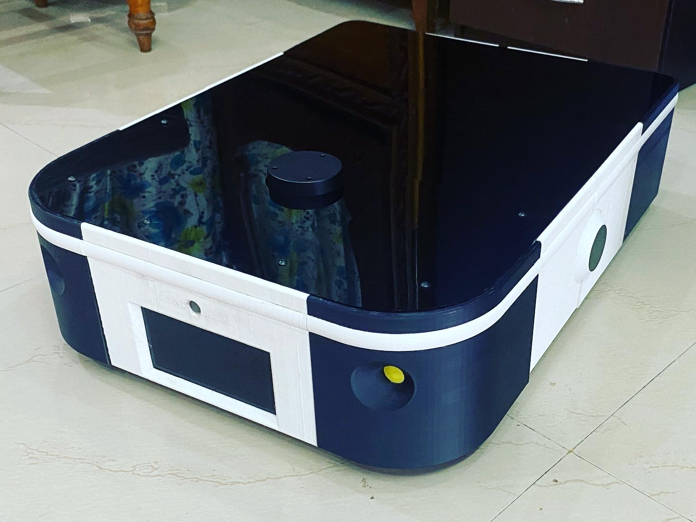
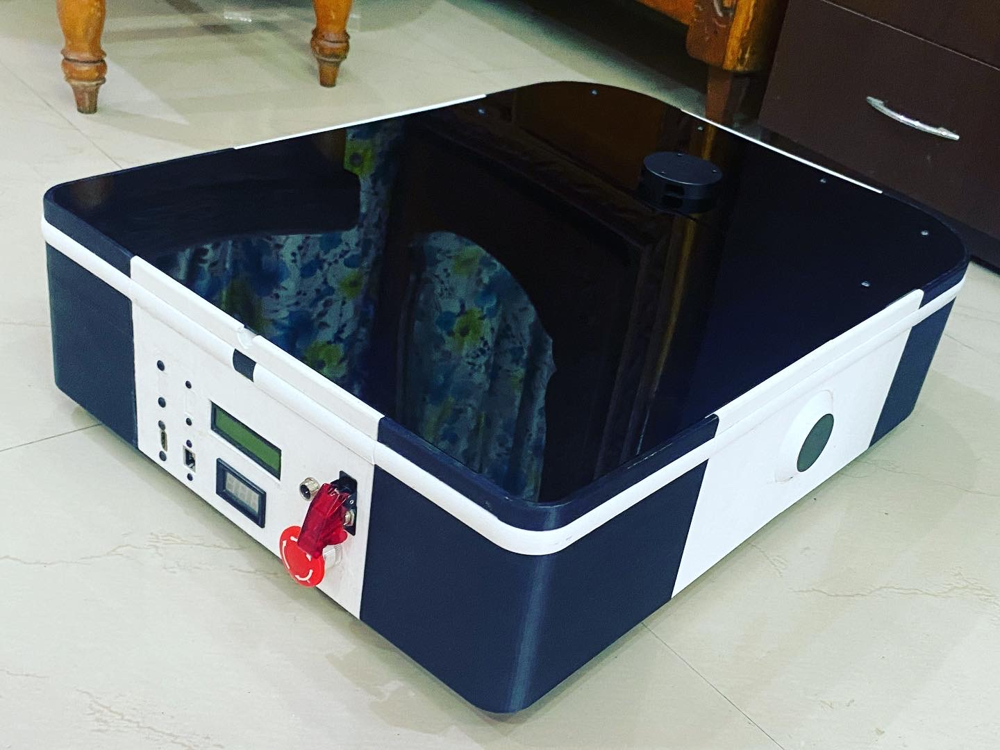

<!-- PROJECT SHIELDS -->

[![ROS][ros-shield]][ros-url] [![Contributors][contributors-shield]][contributors-url] [![Last Commit][last-commit-shield]][last-commit-url] [![Stargazers][stars-shield]][stars-url] [![Issues][issues-shield]][issues-url] [![MIT License][license-shield]][license-url]

<!-- PROJECT LOGO -->

<div align="center">
<h3 align="center">NINJABOT</h3>
<h6 align="center">Autonomous Mobile Robot</h6>
 <a href="https://github.com/chaitanya-mandala/ninjabot">
    
    
    
  </a>
</div>

</br>
<!-- TABLE OF CONTENTS -->
<details>
  <summary>Table of Contents</summary>
  <ol>
    <li>
      <a href="#simulation">Simulation</a>
      <ul>
        <li><a href="#prerequisites">Setup</a></li>
        <li><a href="#installation">Gazebo</a></li>
        <li><a href="#installation">Rviz</a></li>
        <li><a href="#installation">Teleop</a></li>
        <li><a href="#installation">Mapping</a></li>
        <li><a href="#installation">Navigation</a></li>
      </ul>
    </li>
    <li>
      <a href="#real-robot">Real Robot</a>
      <ul>
        <li><a href="#prerequisites">Prerequisites</a></li>
        <li><a href="#installation">SSH connection local & wifi</a></li>
        <li><a href="#installation">Add or remove wifi</a></li>
        <li><a href="#installation">Network configuration for robot & pc</a></li>
        <li><a href="#installation">Rviz</a></li>
        <li><a href="#installation">Teleop</a></li>
        <li><a href="#installation">Mapping</a></li>
        <li><a href="#installation">Navigation</a></li>
      </ul>
    </li>
    <li><a href="#roadmap">Roadmap</a></li>
    <li><a href="#contributing">Contributing</a></li>
    <li><a href="#license">License</a></li>
    <li><a href="#contact">Contact</a></li>
    <li><a href="#acknowledgments">Acknowledgments</a></li>
  </ol>
</details>

<!-- GETTING STARTED -->

## Getting Started

This is an example of how you may give instructions on setting up your project locally.
To get a local copy up and running follow these simple example steps.

### Prerequisites

This is an example of how to list things you need to use the software and how to install them.

- npm
  ```sh
  npm install npm@latest -g
  ```

### Installation

1. Get a free API Key at [https://example.com](https://example.com)
2. Clone the repo
   ```sh
   git clone https://github.com/chaitanya-mandala/ninjabot.git
   ```
3. Install NPM packages
   ```sh
   npm install
   ```
4. Enter your API in `config.js`
   ```js
   const API_KEY = "ENTER YOUR API";
   ```

<!-- ROADMAP -->

## Roadmap

- [ ] Add Sample Codes package
<!-- - [ ] Feature 3
  - [ ] Nested Feature -->

See the [open issues](https://github.com/chaitanya-mandala/ninjabot/issues) for a full list of proposed features (and known issues).

<!-- CONTRIBUTING -->

## Contributing

Contributions are what make the open source community such an amazing place to learn, inspire, and create. Any contributions you make are **greatly appreciated**.

If you have a suggestion that would make this better, please fork the repo and create a pull request. You can also simply open an issue with the tag "enhancement".
Don't forget to give the project a star! Thanks again!

1. Fork the Project
2. Create your Feature Branch (`git checkout -b feature/AmazingFeature`)
3. Commit your Changes (`git commit -m 'Add some AmazingFeature'`)
4. Push to the Branch (`git push origin feature/AmazingFeature`)
5. Open a Pull Request

<!-- LICENSE -->

## License

Distributed under the MIT License. See `LICENSE.txt` for more information.

<!-- CONTACT -->

## Contact

MNV Chaitanya Kumar - nagachaitanya948@gmail.com

Project Link: [https://github.com/chaitanya-mandala/ninjabot](https://github.com/chaitanya-mandala/ninjabot)

<!-- ACKNOWLEDGMENTS -->

## Acknowledgments

- []()
- []()
- []()

<!-- MARKDOWN LINKS & IMAGES -->
<!-- https://www.markdownguide.org/basic-syntax/#reference-style-links -->

[contributors-shield]: https://img.shields.io/github/contributors/chaitanya-mandala/ninjabot.svg?style=for-the-badge
[contributors-url]: https://github.com/chaitanya-mandala/ninjabot/graphs/contributors
[last-commit-shield]: https://img.shields.io/github/last-commit/chaitanya-mandala/ninjabot/noetic.svg?style=for-the-badge
[last-commit-url]: https://github.com/chaitanya-mandala/ninjabot/commit/noetic
[stars-shield]: https://img.shields.io/github/stars/chaitanya-mandala/ninjabot.svg?style=for-the-badge
[stars-url]: https://github.com/chaitanya-mandala/ninjabot/stargazers
[issues-shield]: https://img.shields.io/github/issues/chaitanya-mandala/ninjabot.svg?style=for-the-badge
[issues-url]: https://github.com/chaitanya-mandala/ninjabot/issues
[license-shield]: https://img.shields.io/github/license/chaitanya-mandala/ninjabot.svg?style=for-the-badge
[license-url]: https://github.com/chaitanya-mandala/ninjabot/blob/master/LICENSE.txt
[ros-shield]: https://img.shields.io/badge/ROS-noetic-green?style=for-the-badge&logo=ros
[ros-url]: http://wiki.ros.org/noetic
[product-screenshot]: images/screenshot.png
